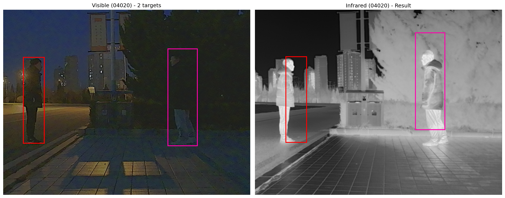

# RGB-IR Cross-Modality Object Registration

基于 VGG 特征提取与 Sobel 边缘引导的可见光-红外图像跨模态目标框配准工具。

本项目旨在解决多模态场景下的目标定位迁移问题。通过利用预训练 VGG16 提取深层纹理特征，结合 Sobel 算子筛选高频边缘区域，并使用改进的 RANSAC 算法，实现将可见光图像（RGB）中的 YOLO 格式目标检测框高精度映射到红外图像（IR）中。



## ✨ 主要功能

* **Sobel 边缘引导匹配**：引入 Sobel 算子预处理，仅在纹理显著区域（边缘）进行特征点采样，有效过滤背景噪声，提升匹配精度。
* **VGG 深层特征提取**：利用冻结参数的 VGG16 (前 3 个 Block) 提取具有平移不变性的深度特征，并结合 Instance Normalization 去除光照差异。
* **智能 RANSAC 配准**：基于特征相关性矩阵进行点对匹配，并通过 RANSAC 估算仿射变换矩阵，包含尺度校验与位移兜底策略。
* **批量评估与可视化**：自动处理整个数据集，生成配准后的对比图，并输出包含中心点误差 (Pixel Error) 的详细量化报告。

## 📂 项目结构

本项目采用模块化设计，目录结构如下：

```text
Project_Root/
├── core/                  # 核心算法模块
│   ├── matcher.py         # 相关性计算与 RANSAC 几何匹配逻辑
│   └── metrics.py         # 误差计算 (中心点漂移、尺寸偏差)
│   └── extractor.py       # VGG特征提取网络
├── utils/                 # 工具模块
│   ├── file_ops.py        # 文件路径管理、YOLO标签读取、日志写入
│   ├── image_ops.py       # 图像读取、Sobel 预处理、Tensor转换
│   └── visualizer.py      # 结果绘图与可视化
├── Datasets/              # 数据集目录 (需用户创建)
│   ├── vi/                # 可见光图像
│   ├── ir/                # 红外图像
│   └── labels/            # 对应的 YOLO 格式标签
├── main.py                # 程序主入口
├── requirements.txt       # 依赖清单
└── README.md              # 项目说明文档
```

## 🛠️ 环境依赖

请确保安装 Python 3.8+ 及以下依赖库：

```bash
pip install torch torchvision opencv-python numpy matplotlib tqdm
```

## 🚀 数据准备

请按照以下结构组织数据。**注意：文件名（不含后缀）必须一一对应。**

1.  **Datasets/vi/**: 放入可见光图片 (.jpg, .png, .bmp)。
2.  **Datasets/ir/**: 放入红外图片。
3.  **Datasets/labels/**: 放入对应的 YOLO 格式标签 (.txt)。

**标签格式示例 (YOLO):**

```text
<class_id> <x_center> <y_center> <width> <height>
0 0.45 0.32 0.15 0.20
```

*(注：程序读取每行的第 2-5 列作为归一化坐标)*

## ⚡ 使用方法

在项目根目录下运行：

```bash
python main.py
```

程序将自动执行以下流程：

1.  加载 VGG 提取器模型。
2.  扫描 `Datasets` 目录下的配对图像。
3.  对每张图片进行 Sobel 处理与特征提取。
4.  计算仿射变换矩阵并迁移目标框。
5.  在 `runs/exp/` 目录下保存结果。

## 📊 输出结果

运行完成后，结果保存在 `runs/exp{N}` 文件夹中：

  * **`*_results.png`**: 可视化对比图。
      * **左图 (Visible)**: 显示原始 YOLO 标签框（GT）。
      * **右图 (Infrared)**: 显示经算法变换后的预测框。
  * **`results.txt`**: 详细的量化评估报告。

**报告示例 (results.txt):**

```text
[Image ID: 001]
============================================================
Idx  | GT Center       | Pred Center     | Diff(px) | Size Diff(W,H)
------------------------------------------------------------
0    | (340, 210)      | (342, 212)      | 2.83     | (1.0, -0.5)
1    | (512, 100)      | (512, 100)      | 0.00     | (0.1, 0.2)
============================================================
平均中心点误差: 1.41 像素
```

## 🧠 算法核心逻辑

1.  **特征提取**: 输入图像 -\> `Sobel` 增强 -\> `VGG16 Features` -\> `InstanceNorm`。
2.  **网格采样**: 在源图像 (RGB) 的 GT 框内生成网格点，利用 Sobel 图剔除低梯度点（平滑区域）。
3.  **相关性匹配**: 计算 RGB 特征与 IR 特征的余弦相似度，在局部窗口内搜索最佳匹配点。
4.  **变换估计**: 使用 `cv2.estimateAffinePartial2D` (RANSAC) 计算变换矩阵。
5.  **误差分析**: 计算变换后框中心与理论真值（假设红外与可见光存在对齐关系）的欧氏距离。

## 📝 待办事项 / 改进方向

  - [ ] 继续提升性能。
  - [ ] 添加 ResNet 或 LoFTR 等更先进的特征提取器选项。
  - [ ] 尝试优化处理流程，减少限制。